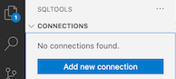

# SQLTools intersystems-iris-driver Driver

## Installation
- [Install SQLTools in VS Code from the Marketplace](https://marketplace.visualstudio.com/items?itemName=mtxr.sqltools)
- Install the InterSystems extension to SQLTools (pre-release version)
  - [Go to the GitHub releases page](https://github.com/intersystems-community/sqltools-intersystems-driver/releases)
  - Expand Assets triangle for the latest version
  - Download the file ending in `.vsix`
  - Drag the downloaded file onto VS Code

## Configuration

- Click the SQLTools icon in the Activity pane (left side of VS Code)  
  
- Click "Add new connection"  
  
- Click InterSystems IRIS
- Fill out connection information
- Test the connection

## Use

With a connection defined, you can now write SQL, browse tables, etc.

### To write raw SQL
- Click the "New SQL file" icon
- Write your SQL statement
- Click "Run on active connection"
- Or, select the SQL statement text, and execute it
  - either right-click and select "Run selected query" from the contentual menu
  - or type Command-E, Command-E (Mac)
  - or type Ctrl-E, Ctrl-E (Windows)

### To browse tables

- Click on your connection
- Click on "Tables"
- Right-click on the table of interest
- From the contextual menu, select "Show table records"